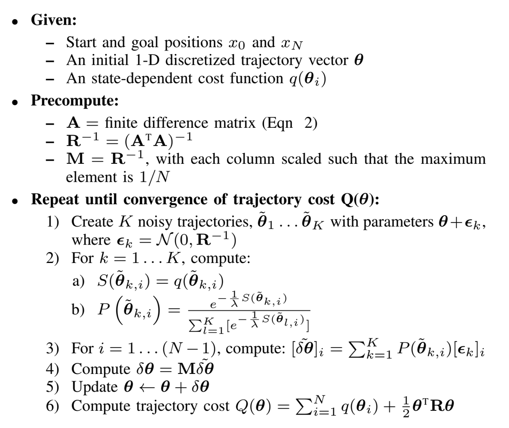

March 2022
# STOMP Trajectory Planner for Robotic Arm Manipulation

This project implements the STOMP algorithm in Matlab to plan trajectories for 6-DOF robotic arms to manouvre within an obstacle-laden course. The video below demonstrates the performance of the algo in a sample scenario.

## STOMP

The STOMP (Stochastic Optimization for Trajectory Planning with Heteroscedastic Gaussian Processes) algo samples a series of noisy trajectories to explore the space around an initial trajectory which are then combined to produce an updated trajectory with lower cost. The detailed algorithm is as follows

## Simulation

Running the "KINOVA_STOMP_Path_Planning.mlx" file will display results of the algorithm in simulation.

The file "helperSTOMP.m" is the main algorithm implementation that calls other functions in the folder.

Modify "helperCreateObstaclesKINOVA.m" to change the position of the obstacles.